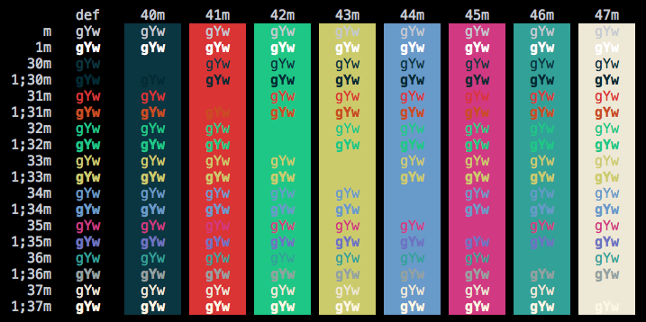

# Ruslan Osipov's Theme - For QTerminal and iTerm2

I came across a fantastic theme called 'rosipov' as part of the default install for Git-Bash on Windows. I fell in love and wanted to use it on Linux and macOS as well! This color scheme was created by [Ruslan Ospivov](https://www.rosipov.com) and the values are taken directly from [his blog post here](https://www.rosipov.com/blog/mintty-color-scheme-cygwin/).

`Rosipov` - The original, exact values from his blog post.

`Rosipov-lightfg` - Same theme but lightened up the primary foreground text a bit.

## Installation

### QTerminal on Linux

- Copy the `.colorscheme` file of your choice to `/usr/share/qtermwidget5/color-schemes`
- Close and re-open `qterminal`
- Open __Preferences > Appearance__ and select the theme

### iTerm2 on macOS

- Open __Preferences > Profiles > Colors__ (shortcut `Cmd-I`)
- Select the __Color Presets...__ drop-down menu
- Select __Import...__
- Import the `.itermcolors` file of your choosing
