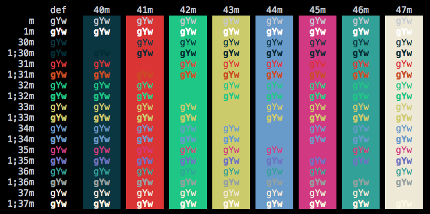

## Ruslan Osipov's Theme - For iTerm2, QTerminal, xfce4-terminal, Terminator

I came across a delightful theme as part of Mintty on Windows, called `rosipov`. I fell in love and
wanted to use it in my other terminals. This color scheme was created by [Ruslan Osipov](https://www.rosipov.com)
and the values are taken directly from [his blog post here](https://www.rosipov.com/blog/mintty-color-scheme-cygwin/).

There are two versions: the original values or one with a brighter foreground value.

## Installation

### iTerm2 on macOS

- Open __Preferences > Profiles > Colors__ (shortcut `Cmd-I`)
- Select the __Color Presets...__ drop-down menu
- Select __Import...__
- Import the `.itermcolors` file of your choosing

### QTerminal

- Copy `.colorscheme` file to `/usr/share/qtermwidget5/color-schemes`
- Close and re-open `qterminal`
- Open __Preferences > Appearance__ and select the theme

### xfce4-terminal

- Copy `.theme` file to `/usr/share/xfce4/terminal/colorschemes`
- Open __Preferences > Colors > Presets__ and select the theme

### Terminator

- Open `~/.config/terminator/config` inside will be a `[[default]]` section with your current color scheme
- Copy/paste the `Rosipov.config` contents and replace the default profile, keeping the `[[default]]` heading
- Alternatively, you can append it beneath the default profile, creating a 2nd profile for Rosipov
- If you want to use non-default profiles, make sure __Preferences > Global > "Re-use profiles for new terminals"__ is checked
